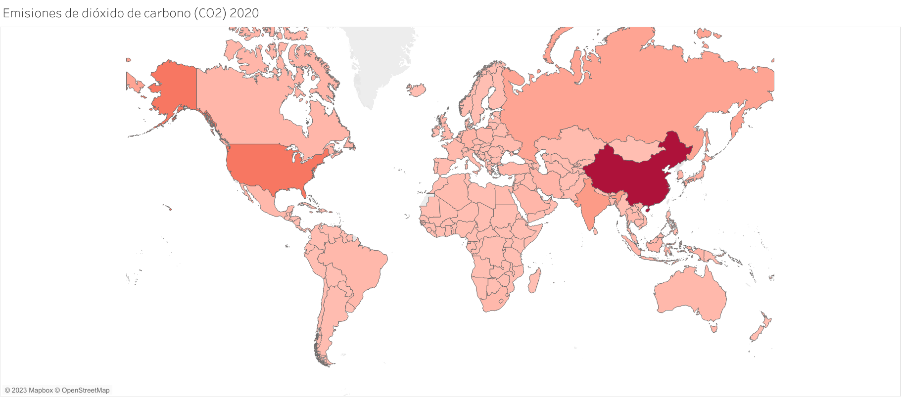
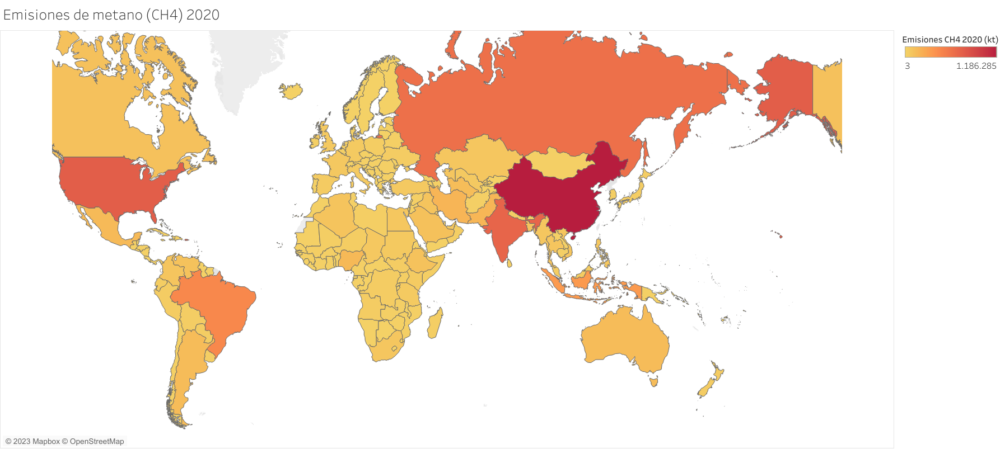
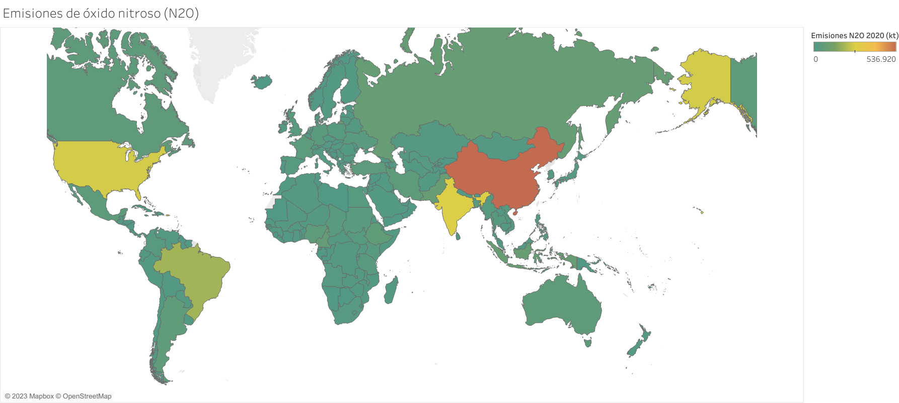
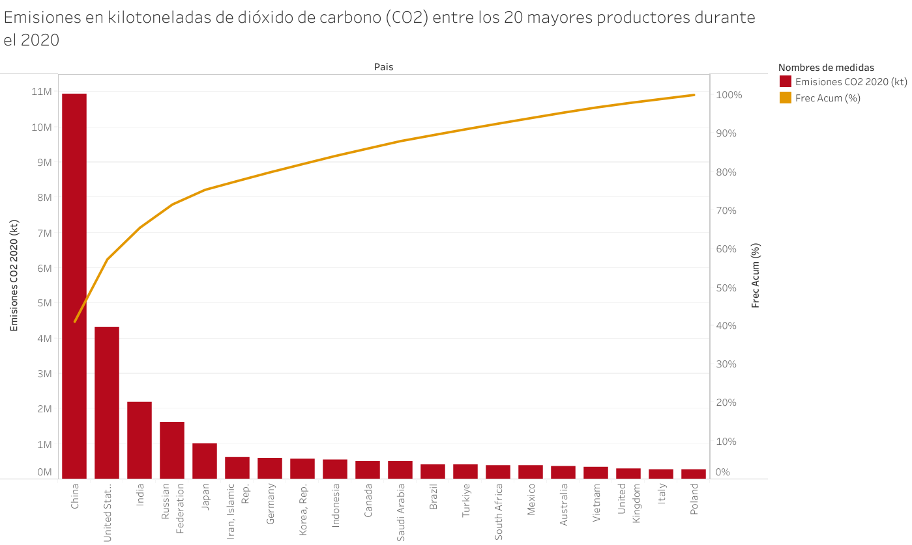
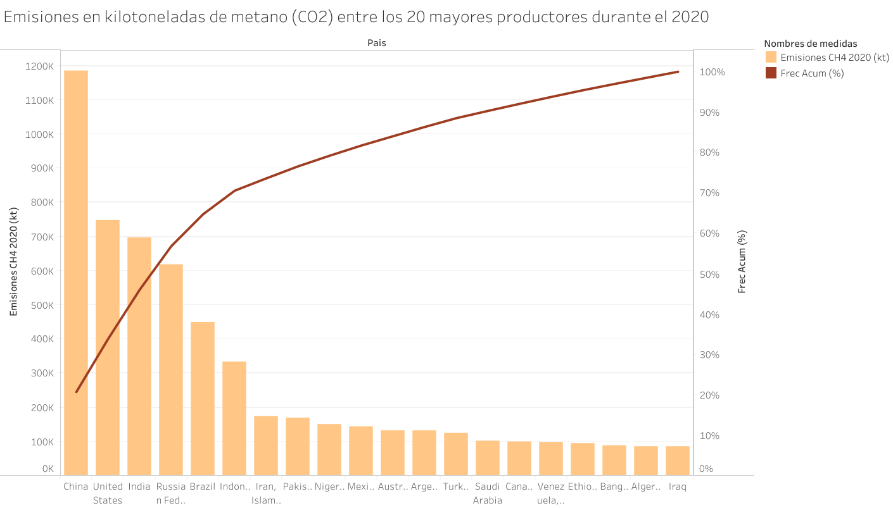
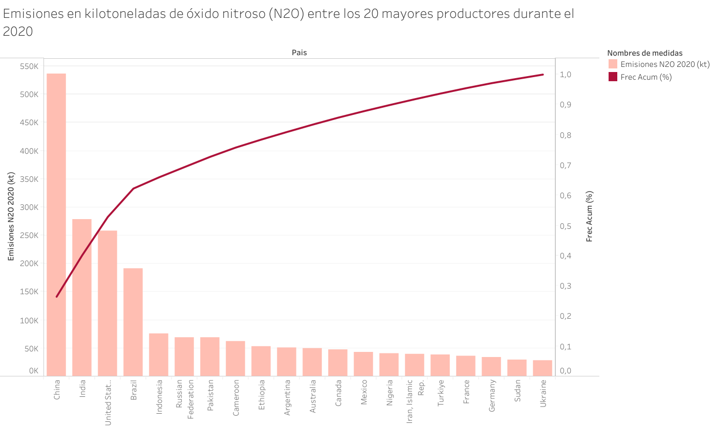

# Introducción

El presente proyecto de análisis fue realizado en base a datos de emisiones de CO2 (dióxido de carbono), N20 (óxido nitroso) y CH4 (metano), bajo licencia del Banco Mundial y publicados en [Kaggle](https://www.kaggle.com/datasets/aniruddha1995/firethorn-10-world-co2-emission-analysis) por el usuario Aniruddha Kalblande.

## Sobre el set de datos y el enfoque de análisis

Los datos estudiados comprenden una colección detallada de indicadores medioambientales generados por varios países de todo el mundo, a lo largo de un extenso período histórico de más de 60 años. Gracias a este conjunto de datos, se pueden realizar diferentes análisis desde múltiples perspectivas. Para este en particular nos enfocaremos en los datos más actualizados que se registran, a fines de realizar un estudio descriptivo y gráfico que nos permita obtener conclusiones fundadas sobre la situación medioambiental del mundo y qué curso de acción se debería tomar.

El código y los correspondientes archivos generados y documentación se encuentran disponibles en el [repositorio de Github]() de este proyecto para su descarga y vista en detalle.

## Herramientas utilizadas

RStudio para exploración, limpieza y exportación y Tableau para presentación de gráficas y tablas.

# Organización de datos y exploración

Seteamos el archivo descargado y lo nombramos como "co2_data.csv". Configuramos el repositorio de GitHub y el directorio de trabajo en la misma ubicación. Una vez listo, desde RStudio, instalaremos y cargaremos la librería 'tidyverse'.

```{r}
library(tidyverse)
```

Luego, haremos una primera aproximación a los datos con algunas funciones básicas:

```{r}
as_tibble(read_csv("co2_data.csv"))
str(read_csv("co2_data.csv"))
col(read_csv("co2_data.csv"))
print(read_csv("co2_data.csv"))
```

El set comprende una gran cantidad de campos. Muchos de ellos clasificados en subcategorías.

Se observa también una gran presencia de incompletos (...) que, por ahora, no borraremos hasta tener un conocimiento más exacto de la estructura del set de datos.

Notamos también la presencia de números de gran magnitud que, por lo general, RStudio suele formatear como números en notación científica. Para que esto no suceda y la lectura sea fácil, preparamos el programa con:

```{r}
options(scipen = 999)
```

Comenzamos a trabajar alojando el set de datos inicial en una variable.

```{r}
co2_df <- read.csv("co2_data.csv")
```

Como punto de partida, cambiamos los nombres de las columnas y formateamos sus datos como números.

```{r}
co2_df <- co2_df %>%
  rename(Pais=Country.Name,
         Cod_Pais=Country.Code,
         Serie=Series.Name,
         Cod_Serie=Series.Code,
         Año_1960=X1960..YR1960.,
         Año_1961=X1961..YR1961.,
         Año_1962=X1962..YR1962.,
         Año_1963=X1963..YR1963.,
         Año_1964=X1964..YR1964.,
         Año_1965=X1965..YR1965.,
         Año_1966=X1966..YR1966.,
         Año_1967=X1967..YR1967.,
         Año_1968=X1968..YR1968.,
         Año_1969=X1969..YR1969.,
         Año_1970=X1970..YR1970.,
         Año_1971=X1971..YR1971.,
         Año_1972=X1972..YR1972.,
         Año_1973=X1973..YR1973.,
         Año_1974=X1974..YR1974.,
         Año_1975=X1975..YR1975.,
         Año_1976=X1976..YR1976.,
         Año_1977=X1977..YR1977.,
         Año_1978=X1978..YR1978.,
         Año_1979=X1979..YR1979.,
         Año_1980=X1980..YR1980.,
         Año_1981=X1981..YR1981.,
         Año_1982=X1982..YR1982.,
         Año_1983=X1983..YR1983.,
         Año_1984=X1984..YR1984.,
         Año_1985=X1985..YR1985.,
         Año_1986=X1986..YR1986.,
         Año_1987=X1987..YR1987.,
         Año_1988=X1988..YR1988.,
         Año_1989=X1989..YR1989.,
         Año_1990=X1990..YR1990.,
         Año_1991=X1991..YR1991.,
         Año_1992=X1992..YR1992.,
         Año_1993=X1993..YR1993.,
         Año_1994=X1994..YR1994.,
         Año_1995=X1995..YR1995.,
         Año_1996=X1996..YR1996.,
         Año_1997=X1997..YR1997.,
         Año_1998=X1998..YR1998.,
         Año_1999=X1999..YR1999.,
         Año_2000=X2000..YR2000.,
         Año_2001=X2001..YR2001.,
         Año_2002=X2002..YR2002.,
         Año_2003=X2003..YR2003.,
         Año_2004=X2004..YR2004.,
         Año_2005=X2005..YR2005.,
         Año_2006=X2006..YR2006.,
         Año_2007=X2007..YR2007.,
         Año_2008=X2008..YR2008.,
         Año_2009=X2009..YR2009.,
         Año_2010=X2010..YR2010.,
         Año_2011=X2011..YR2011.,
         Año_2012=X2012..YR2012.,
         Año_2013=X2013..YR2013.,
         Año_2014=X2014..YR2014.,
         Año_2015=X2015..YR2015.,
         Año_2016=X2016..YR2016.,
         Año_2017=X2017..YR2017.,
         Año_2018=X2018..YR2018.,
         Año_2019=X2019..YR2019.,
         Año_2020=X2020..YR2020.,
         Año_2021=X2021..YR2021.,
         Año_2022=X2022..YR2022.) %>% 
  mutate(Año_1960=as.numeric(Año_1960),
         Año_1960=as.numeric(Año_1960),
         Año_1961=as.numeric(Año_1961),
         Año_1962=as.numeric(Año_1962),
         Año_1963=as.numeric(Año_1963),
         Año_1964=as.numeric(Año_1964),
         Año_1965=as.numeric(Año_1965),
         Año_1966=as.numeric(Año_1966),
         Año_1967=as.numeric(Año_1967),
         Año_1968=as.numeric(Año_1968),
         Año_1969=as.numeric(Año_1969),
         Año_1970=as.numeric(Año_1970),
         Año_1971=as.numeric(Año_1971),
         Año_1972=as.numeric(Año_1972),
         Año_1973=as.numeric(Año_1973),
         Año_1974=as.numeric(Año_1974),
         Año_1975=as.numeric(Año_1975),
         Año_1976=as.numeric(Año_1976),
         Año_1977=as.numeric(Año_1977),
         Año_1978=as.numeric(Año_1978),
         Año_1979=as.numeric(Año_1979),
         Año_1980=as.numeric(Año_1980),
         Año_1981=as.numeric(Año_1981),
         Año_1982=as.numeric(Año_1982),
         Año_1983=as.numeric(Año_1983),
         Año_1984=as.numeric(Año_1984),
         Año_1985=as.numeric(Año_1985),
         Año_1986=as.numeric(Año_1986),
         Año_1987=as.numeric(Año_1987),
         Año_1988=as.numeric(Año_1988),
         Año_1989=as.numeric(Año_1989),
         Año_1990=as.numeric(Año_1990),
         Año_1991=as.numeric(Año_1991),
         Año_1992=as.numeric(Año_1992),
         Año_1993=as.numeric(Año_1993),
         Año_1994=as.numeric(Año_1994),
         Año_1995=as.numeric(Año_1995),
         Año_1996=as.numeric(Año_1996),
         Año_1997=as.numeric(Año_1997),
         Año_1998=as.numeric(Año_1998),
         Año_1999=as.numeric(Año_1999),
         Año_2000=as.numeric(Año_2000),
         Año_2001=as.numeric(Año_2001),
         Año_2002=as.numeric(Año_2002),
         Año_2003=as.numeric(Año_2003),
         Año_2004=as.numeric(Año_2004),
         Año_2005=as.numeric(Año_2005),
         Año_2006=as.numeric(Año_2006),
         Año_2007=as.numeric(Año_2007),
         Año_2008=as.numeric(Año_2008),
         Año_2009=as.numeric(Año_2009),
         Año_2010=as.numeric(Año_2010),
         Año_2011=as.numeric(Año_2011),
         Año_2012=as.numeric(Año_2012),
         Año_2013=as.numeric(Año_2013),
         Año_2014=as.numeric(Año_2014),
         Año_2015=as.numeric(Año_2015),
         Año_2016=as.numeric(Año_2016),
         Año_2017=as.numeric(Año_2017),
         Año_2018=as.numeric(Año_2018),
         Año_2019=as.numeric(Año_2019),
         Año_2020=as.numeric(Año_2020),
         Año_2021=as.numeric(Año_2021),
         Año_2022=as.numeric(Año_2022))
```

```{r}
as_tibble(co2_df)
```

Ahora contamos con un set de datos formateado con el cual, si quisiéramos, podríamos analizar de diferentes formas en función de la información que querramos obtener del mismo. 

Para este análisis, nos interesa saber qué datos se encuentran completos para cada país en el año 2020 (el último año que registra datos en el set) y con ello en mente continuamos explorando, prestando atención a algunas de las subcategorías que se presentan en la columna "Serie".

Vemos que una buena opción para esto, son los datos categorizados como:

* CO2 emissions (kt), es decir, las emisiones de dióxido de carbono en kilotoneladas
* Methane emissions (kt of CO2 equivalent), que representa las emisiones de metano en kilotoneladas equivalentes de CO2
* Nitrous oxide emissions (thousand metric tons of CO2 equivalent), que son las emisiones de óxido nitroso en toneladas de CO2 equivalentes.

Creamos entonces data frames nuevos a partir del original, filtrando por categorías:

```{r}
co2_emisiones_2020 <- co2_2020 %>% 
  filter(Serie == "CO2 emissions (kt)") %>% 
  select(Pais, Año_2020)

as_tibble(co2_emisiones_2020)
```

```{r}
ch4_2020 <- co2_2020 %>% 
  filter(Serie == "Methane emissions (kt of CO2 equivalent)") %>% 
  select(Pais, Año_2020)

as_tibble(ch4_2020)
```

```{r}
no2_2020 <- co2_2020 %>% 
  filter(Serie == "Nitrous oxide emissions (thousand metric tons of CO2 equivalent)") %>% 
  select(Pais, Año_2020)

as_tibble(no2_2020)
```

Para estos tres casos vemos que los data frames resultantes se ven bastante sólidos y completos en su generalidad, a excepción de algunos casos faltantes, que comprobaremos más adelante.

Otras categorías que exploramos son:

* CO2 emissions from electricity and heat production, total (% of total fuel combustion), es decir emisiones de dióxido de carbono provenientes de la generación de electricidad y de calor.
* CO2 emissions from gaseous fuel consumption (% of total), que representa al porcentaje del total de emisiones de CO2 provenientes de consumo de combustible gaseoso.
* CO2 emissions from liquid fuel consumption (kt), que serían las emisiones de CO2 provenientes del consumo de combustible líquido.

Sin embargo, al hacer los dataframes veremos que en su totalidad los datos se encuentran incompletos. Esto puede comprobarse en el script disponible en el repositorio del proyecto.

Sabiendo esto, entonces, continuamos nuestro proceso poniendo el foco en la información con la que sí contamos, la cual en su mayoría se encuentra completa, pero presenta algunas faltas en forma de NA (no disponibles.)

Evaluamos la posibilidad de prescindir de estos "no disponibles" para nuestro análisis. Y lo hacemos comparando entre los tres nuevos data frames; buscando si los datos faltantes pertenecen a los mismos países.

El siguiente código, nos devuelve los índices de los países con datos incompletos.

```{r}
which(is.na(no2_2020$Año_2020))
which(is.na(ch4_2020$Año_2020))
which(is.na(co2_emisiones_2020$Año_2020))
```

Para saber a qué país pertenece cada índice, alojamos los datos en variables y escribimos:

```{r}
co2_nas <- co2_emisiones_2020$Pais[which(is.na(co2_emisiones_2020$Año_2020))]
no2_nas <- no2_2020$Pais[which(is.na(no2_2020$Año_2020))]
ch4_nas <- ch4_2020$Pais[which(is.na(ch4_2020$Año_2020))]

print(co2_nas)
print(no2_nas)
print(ch4_nas)
```

Y en este punto, hacemos tres pruebas lógicas para comprobar si efectivamente los datos faltantes se dan en los mismos países con:

```{r}
if(all(co2_nas == no2_nas)){
  "Los países que no registran datos de de emisiones CO2 son los mismos que no registran datos de emisiones de NO2"
}
```

```{r}
if(all(co2_nas == ch4_nas)){
  "Los países que no registran datos de de emisiones CO2 son los mismos que no registran datos de emisiones de CH4"
}
```

```{r}
if(all(no2_nas == ch4_nas)){
  "Los países que no registran datos de de emisiones NO2 son los mismos que no registran datos de emisiones CH4"
}
```

En los tres casos, se cumple la condición de igualdad.

Sabiendo a ciencia cierta la estructura de los datos, y viendo que no altera la representatividad del análisis, decidimos eliminar los datos faltantes.

Antes de eso, eliminamos las variables que utilizamos en la prueba lógica para limpiar nuestro entorno de trabajo.

```{r}
rm(no2_nas)
rm(co2_nas)
rm(ch4_nas)
```

Y ahora sí, comenzamos a limpiar.

## Limpieza

En otro vistazo a los datos, vemos que a partir de la fila 192 los datos se encuentran agrupados por regiones. Esto presenta otra oportunidad para separar, por un lado, países y por otro regiones. 

Al eliminar los incompletos, también agregaremos una función de filtro para hacer la distinción entre países y regiones.

A continuación, hacemos tres dataframes que representan las emisiones de CO2, CH4 y NO2 por cada país:

```{r}
co2_paises_2020 <- co2_emisiones_2020 %>% 
  drop_na(Año_2020) %>% 
  filter(row_number()<=191)
print(co2_paises_2020)
```

```{r}
ch4_paises_2020 <- ch4_2020 %>% 
  drop_na(Año_2020) %>% 
  filter(row_number()<=191)
print(ch4_paises_2020)
```

```{r}
no2_paises_2020 <- no2_2020 %>% 
  drop_na(Año_2020) %>% 
  filter(row_number()<=191)
print(no2_paises_2020)
```

Y luego hacemos otros tres para las emisiones por cada región:

```{r}
regions_co2_2020 <- co2_emisiones_2020 %>% 
  drop_na(Año_2020) %>% 
  filter(row_number()>191)
print(regions_co2_2020)
```

```{r}
regions_ch4_2020 <- ch4_2020 %>% 
  drop_na(Año_2020) %>% 
  filter(row_number()>191)
print(regions_co2_2020)
```

```{r}
regions_no2_2020 <- no2_2020 %>% 
  drop_na(Año_2020) %>% 
  filter(row_number()>191)
print(regions_co2_2020)
```

Con lo cual, ya contamos con los datos limpios y listos para efectuar análisis descriptivos y gráficas.

# Análisis descriptivo

## Medidas

```{r}
mediaCO2 <- mean(co2_paises_2020$Año_2020)
cuartilesCO2 <- quantile(co2_paises_2020$Año_2020)
maximoCO2 <- max(co2_paises_2020$Año_2020)
percentilesC02 <- quantile(co2_paises_2020$Año_2020, prob=seq(0, 1, length = 191))
```

```{r}
print(mediaCO2)
print(cuartilesCO2)
print(percentilesC02)
print(maximoCO2)
```

Estos datos nos indican que se trata de una distribución bastante asimétrica. Es decir, el máximo presenta una variación muy grande en comparación con sus valores anteriores, lo que nos dice que utilizar la media aritmética se hace poco representativo, y por ende no adecuado, ya que afirmar que "en promedio, cada país del mundo emite 169 mil kilotoneladas de CO2 por año" sería como atribuirle el problema a países que no corresponden y quitándole muchísima precisión al análisis.

Por esto, se hace más adecuado utilizar medidas de posición como los cuartiles y la mediana. Estos nos permiten afirmar que:

* Un 75% de los países del mundo emiten hasta alrededor de 61 mil kilotoneladas de CO2.

* Hasta un 50% de los países del mundo emiten alrededor de 11 mil kilotoneladas de CO2.

* El mayor emisor de dióxido de carbono es China, que registra casi 11 millones de kilotoneladas.

Como vemos, es una sección muy pequeña de la distribución la que concentra la mayor cantidad de emisiones. Esto tiende a repetirse con los datos de NO2 y CH4.

```{r}
mediaCH4 <- mean(ch4_paises_2020$Año_2020)
cuartilesCH4 <- quantile(ch4_paises_2020$Año_2020)
maximoCH4 <- max(ch4_paises_2020$Año_2020)
```

```{r}
str(mediaCH4)
str(cuartilesCH4)
str(maximoCH4)
```

```{r}
mediaNO2 <- mean(no2_paises_2020$Año_2020)
cuartilesNO2 <- quantile(no2_paises_2020$Año_2020)
maximoNO2 <- max(no2_paises_2020$Año_2020)
```

```{r}
print(mediaNO2)
print(cuartilesNO2)
print(maximoNO2)
```

## Tablas

Ahora que sabemos que las emisiones de gases se encuentran distribuidas de manera asimétrica, nos podemos permitir realizar tablas que representen a los 20 países que registran mayores emisiones de CO2, N2O y CH4 respectivamente.

A partir de los data frames creados anteriormente, hacemos:

```{r}
top_20_co2 <- co2_paises_2020 %>% 
  arrange(desc(Año_2020)) %>% 
  head(20)
print(top_20_co2)
```

```{r}
top_20_no2 <- no2_paises_2020 %>% 
  arrange(desc(Año_2020)) %>% 
  head(20)
print(top_20_no2)
```

```{r}
top_20_ch4 <- ch4_paises_2020 %>% 
  arrange(desc(Año_2020)) %>% 
  head(20)
print(top_20_ch4)
```


Contamos ahora con tablas simplificadas que podemos fácilmente exportar para seguir trabajando y generar las visualizaciones que nos interesan.

## Exportación de archivos CSV

Generamos entonces el código para exportar los dataframes creados a csv con:

```{r}
write.csv(ch4_paises_2020, "clean_CH4_2020.csv")
write.csv(no2_paises_2020, "clean_NO2_2020.csv")
write.csv(co2_paises_2020, "clean_CO2_2020.csv")
```

```{r}
write.csv(top_20_co2, "top_20_CO2.csv")
write.csv(top_20_no2, "top_20_NO2.csv")
write.csv(top_20_ch4, "top_20_CH4.csv")
```

Estos archivos generados se encuentran disponibles en el repo de GitHub para su descarga.

El resultado obtenido es un pequeño set de archivos livianos, mucho más fáciles de procesar y leer en una hoja de cálculo para generar visualizaciones o tablas. Lo que haremos ahora, entonces, es cargarlos en Google Sheets, consolidando el trabajo en un mismo archivo y haciendo que cada csv se ubique en una hoja diferente.

Se puede acceder a la hoja de cálculo en el siguiente [link](https://docs.google.com/spreadsheets/d/13YySmKXi7j7vD6kEmLbEdxf14iC2qmAwxmmD_4LzYS4/edit?usp=sharing)

# Visualizaciones

Teniendo los datos cargados en una misma hoja de cálculo, podemos hacer las siguientes visualizaciones:

- Mapas que ilustren las emisiones por color (Tableau)
- Diagramas de pareto que muestren quienes concentran la mayor emision entre los 20 mayores emisores de gases invernadero. (Google Sheets)

Para hacer ambas visualizaciones, utilizaremos el archivo XLSX (Excel) generado a partir de los csvs que construimos en RStudio.

Luego generamos las fuentes de datos correspondientes y cargamos en Tableau generando las gráficas correspondientes.

Todas las visualizaciones pueden verse en el siguiente [enlace](https://public.tableau.com/app/profile/mart.n.malandra/viz/EmisionesGlobalesdeGasesInvernadero2020/CO2)

## Mapas de emisiones (2020)

Generamos mapas para cada variable medida: CO2, N2O y CH4.






## Diagramas de pareto

El diagrama de Pareto es un tipo de visualización comúnmente utilizado en el sector industrial para el campo de control de calidad, siendo útil para identificar poco trivial y mucho vital.

Con lo anterior en mente, y con las tablas que preparamos con los 20 países que registran mayores emisiones, generamos los siguientes diagramas







# Interpretación

A partir de toda la información que obtuvimos y visualizamos podemos afirmar que:

* Entre los 20 países de mayores emisiones, China y EE.UU son responsables de más de la mitad de la producción de CO2, registrando un 57% sobre un total de 20, y un 47% sobre el total global.

* El 81,69% de la producción de CO2 del mundo se concentra en 20 países. Siendo China el principal productor, con Italia en el lugar 20.

* El 80% del mundo registra emisiones de hasta 87578 kilotoneladas de CO2.

# Conclusiones y caminos de acción

Aunque para este informe no hicimos un enfrentamiento entre emisiones de gases y PBI, podemos inferir con facilidad que son los países de mayor desarrollo y actividad industrial los que mayores emisiones de CO2 registran. Por lo pronto, con todas las limitaciones de este análisis, todo indica que el impacto medioambiental es indivisible del modelo económico.

Lo que nos dicen los datos es que la responsabilidad y el compromiso de revertir esta situación debe ser asumido por aquellas partes que más responsabilidad tienen en el severo problema medioambiental que enfrenta toda la humanidad

Ante este dilema resulta injusto que se le exijan sacrificios a aquellas porciones del mundo que no estan contribuyendo con el problema pero padecen las consecuencias.

Este análisis deja más preguntas que respuestas. Algunas son:

* ¿Estarán los principales países del mundo dispuestos a asumir responsabilidades frente al problema de la contaminación ambiental?

* ¿De ser necesario, estarán dispuestos los ciudadanos a ceder comodidades y despojarse del actual modelo de consumo?

* ¿Están el sistema económico y social de la humanidad listos para asumir los cambios eventuales para revertir la situación?

Dada la dimensión de la cuestión, no tenemos un alcance de acción directo, pero sí nos llevamos consciencia del dilema. Y con ello una gran responsabilidad para con el futuro.